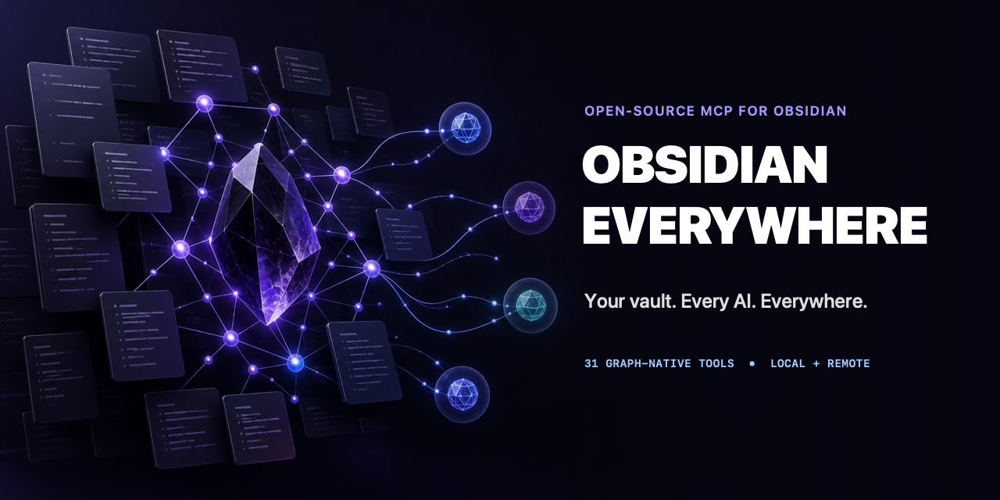

<div align="center">

[English](README.md) | [한국어](README.ko.md)

# 🧠 Obsidian Everywhere

**Obsidian vault를 그래프로 연결해 Codex, ChatGPT, Claude와 모든 MCP 클라이언트에서 사용하세요.**

*Codex CLI · ChatGPT Desktop(Codex) · Claude Code/Desktop · 원격 클라이언트 — 하나의 서버로 모든 환경에서.*

</div>



---

**단순한 Markdown 파일 서버가 아니라 그래프 서버입니다.** AI는 vault를 `.md` 파일이 모인 폴더로만 보지 않습니다. 백링크 탐색, n-hop 이웃, 주제 중심 컨텍스트 번들을 통해 노트와 링크의 관계를 직접 다룹니다. 아직 존재하지 않는 링크도 Obsidian과 마찬가지로 의미 있는 신호로 그래프에 남습니다.

## 목차

- [주요 기능](#주요-기능)
- [서버는 어디에서 실행되나요?](#서버는-어디에서-실행되나요)
- [빠른 시작](#빠른-시작)
- [환경 변수](#환경-변수)
- [개발](#개발)
- [프로젝트 상태](#프로젝트-상태)

## 주요 기능

```text
vault (.md 파일)
  │  파싱 · 감시
  ▼
SQLite 인덱스 (FTS5)  ⇄  인메모리 그래프 (graphology)
  │                         n-hop · 최단 경로 · PageRank
  ▼
31개 MCP 도구
  │
  ▼
stdio  ·  bearer-token HTTP  ·  OAuth HTTP
```

- **실제 그래프 엔진** — wikilink, embed, frontmatter, 중첩 태그, heading, block reference를 파싱합니다. 파일 변경은 전체 재구축 없이 SQLite 인덱스와 그래프에 증분 반영됩니다.
- **31개 MCP 도구** — 그래프 탐색, 구조화·페이지네이션 읽기, 안전한 이동·삭제·부분 편집, rollback 가능한 일괄 정리, regex/목록, Base 정적 검증과 Obsidian 저장 설정 조회·수정을 제공합니다.
- **세 가지 연결 방식** — 로컬 클라이언트는 stdio, 사설 원격 연결은 bearer token 기반 Streamable HTTP, 공개 connector는 OAuth 2.1 기반 Streamable HTTP를 사용합니다.

### 제공 도구

| 읽기 도구 | 용도 |
|---|---|
| `vault_overview` | 노트 수, 주요 태그, PageRank 허브, 최근 수정 노트 확인 |
| `search_notes` | 본문·제목 전문 검색과 태그·폴더 필터 |
| `read_note` | `content`, frontmatter, 링크, 태그를 구조화해 반환하고 줄 단위 페이지네이션 지원 |
| `list_notes` | 폴더 범위와 페이지네이션을 지원하는 명시적 노트 목록 |
| `list_folder` | 한 폴더 바로 아래의 하위 폴더·노트·첨부파일 목록 |
| `regex_search` | 파일·줄·문맥을 포함한 정규식 검색 |
| `get_backlinks` | 특정 노트를 링크한 모든 노트와 해당 문장 조회 |
| `get_neighborhood` | 노트 주변 n-hop 노드와 edge 조회 |
| `get_context_bundle` | 토큰 예산 안에서 중심 노트와 관련 이웃을 묶어 조회 |
| `list_tags` | 중첩 태그 계층과 노트 수 조회 |
| `get_notes_by_tag` | 지정한 태그를 가진 노트 조회 |
| `find_orphans` | 입출력 링크가 없는 노트 검색 |
| `find_unresolved` | 아직 존재하지 않는 링크 검색 |
| `find_path` | 두 노트 사이의 최단 연결 경로 검색 |
| `get_related` | 직접 링크되지 않았지만 유사한 노트 추천 |
| `get_hotkeys`, `get_obsidian_settings` | 저장된 command ID·단축키, 템플릿 폴더, core plugin 설정 조회 |
| `validate_base` | `.base` 또는 fenced Base YAML의 정적 구문·구조 검증 |

| 쓰기 도구 | 용도 |
|---|---|
| `create_note` | frontmatter를 포함한 새 노트 생성 및 즉시 인덱싱 |
| `append_to_note` | 노트 끝이나 특정 heading 아래에 내용 추가 |
| `move_note`, `rename_note`, `delete_note` | 링크 갱신·백링크 보호·휴지통을 포함한 수명주기 작업 |
| `replace_text`, `patch_section` | 정확한 문구 또는 heading 범위 부분 수정 |
| `update_frontmatter`, `remove_frontmatter_field` | 본문을 건드리지 않는 frontmatter 수정 |
| `bulk_replace`, `rollback_bulk_edit` | dry-run·파일 제한·snapshot·rollback이 있는 일괄 치환 |
| `set_hotkey`, `set_templates_folder` | 저장된 Obsidian 설정 수정(앱에서 vault reload가 필요할 수 있음) |

stdio와 bearer-token HTTP에서는 쓰기 도구가 기본 활성화됩니다. 공개 OAuth 연결에서는 기본 비활성화되며 `OAUTH_ENABLE_WRITE_TOOLS=true`로 명시적으로 켤 수 있습니다.

자세한 내부 구조는 [아키텍처 문서](docs/architecture.md), 운영 구성은 [한국어 배포 가이드](docs/deploy.ko.md)를 참고하세요.

## 서버는 어디에서 실행되나요?

`obsidian-everywhere` 프로세스는 vault의 `.md` 파일을 직접 읽고 변경을 감시해야 합니다. 따라서 **vault 파일이 실제로 존재하는 컴퓨터**에서 실행해야 합니다. 클라이언트가 다른 컴퓨터에 있더라도 서버 위치는 바뀌지 않고 연결 방식만 달라집니다.

| 사용 환경 | 연결 방법 |
|---|---|
| vault와 같은 컴퓨터의 Codex, ChatGPT Desktop, Claude | **stdio** — 클라이언트가 서버 프로세스를 직접 실행 |
| 내가 관리하는 다른 컴퓨터 | **bearer-token HTTP + 사설망** — Tailscale 권장 |
| claude.ai 웹·모바일 | **OAuth HTTP + 공개 HTTPS 주소** — Cloudflare Tunnel 사용 가능 |

여러 transport 프로세스를 동시에 실행할 수도 있습니다. v0.2부터 기본 DB 파일은 transport별(`index-stdio.db`, `index-http.db`, `index-oauth.db`)로 분리됩니다. `OBSIDIAN_EVERYWHERE_DB`를 직접 지정할 때도 프로세스마다 서로 다른 경로를 사용하세요.

## 빠른 시작

clone이나 build 없이 vault가 있는 컴퓨터에서 바로 실행합니다.

```bash
npx -y obsidian-everywhere /절대/경로/내/vault
```

실제로는 아래 설정을 통해 MCP 클라이언트가 이 명령을 자동 실행합니다.

### Codex CLI 및 ChatGPT Desktop — 로컬 stdio

Codex CLI, Codex IDE extension, ChatGPT Desktop의 Codex 기능은 같은 MCP 설정을 공유합니다. 한 번만 등록하면 됩니다.

```bash
codex mcp add obsidian-everywhere -- npx -y obsidian-everywhere /절대/경로/내/vault
codex mcp list
```

등록 후 ChatGPT Desktop 또는 IDE extension을 재시작하세요. ChatGPT Desktop의 **Settings → MCP servers → Add server**에서 **STDIO**를 선택해 같은 command와 args를 입력할 수도 있습니다. Codex에서 `/mcp`를 입력하면 서버와 도구 연결 상태를 확인할 수 있습니다.

프로젝트 단위로 설정하려면 신뢰된 프로젝트의 `.codex/config.toml`에 아래 내용을 추가하세요. 모든 프로젝트에서 사용하려면 `~/.codex/config.toml`을 사용합니다.

```toml
[mcp_servers.obsidian-everywhere]
command = "npx"
args = ["-y", "obsidian-everywhere", "/절대/경로/내/vault"]
startup_timeout_sec = 30
```

vault에는 반드시 절대경로를 사용하세요. GUI 앱은 터미널과 같은 `PATH`를 상속하지 않을 수 있습니다. `npx`를 찾지 못하면 `command -v npx`의 절대경로를 `command`에 넣으세요. 자세한 현재 설정 형식은 [OpenAI 공식 MCP 문서](https://learn.chatgpt.com/docs/extend/mcp)를 참고하세요.

### Claude Code — 로컬 stdio

```bash
claude mcp add obsidian-everywhere -- npx -y obsidian-everywhere /절대/경로/내/vault
```

### Claude Desktop — 로컬 stdio

`claude_desktop_config.json`에 추가합니다.

```json
{
  "mcpServers": {
    "obsidian-everywhere": {
      "command": "npx",
      "args": ["-y", "obsidian-everywhere", "/절대/경로/내/vault"]
    }
  }
}
```

### Codex 및 ChatGPT Desktop — 다른 컴퓨터에서 연결

vault 컴퓨터에서 HTTP 서버를 실행합니다.

```bash
OBSIDIAN_VAULT_PATH=/절대/경로/내/vault \
OBSIDIAN_EVERYWHERE_TOKEN=$(openssl rand -hex 32) \
npx -y --package obsidian-everywhere obsidian-everywhere-http
```

두 컴퓨터를 Tailscale 같은 사설망에 연결한 뒤 클라이언트 컴퓨터에서 등록합니다.

```bash
export OBSIDIAN_EVERYWHERE_CLIENT_TOKEN="<서버에서 생성한 토큰>"
codex mcp add obsidian-everywhere \
  --url http://<vault-컴퓨터의-tailscale-주소>:3737/mcp \
  --bearer-token-env-var OBSIDIAN_EVERYWHERE_CLIENT_TOKEN
```

ChatGPT Desktop 프로세스에서도 이 환경 변수를 사용할 수 있어야 합니다. 포트 3737은 자체 암호화를 제공하지 않으므로 공개 인터넷에 노출하지 마세요. 전체 과정은 [한국어 배포 가이드](docs/deploy.ko.md)를 참고하세요.

### claude.ai 웹·모바일 — OAuth connector

공개 HTTPS endpoint가 필요합니다. OAuth 서버와 Cloudflare Tunnel 구성 후 claude.ai의 Settings → Connectors → Add custom connector에 `https://내-도메인/mcp`를 등록합니다. 자세한 내용은 [한국어 배포 가이드](docs/deploy.ko.md)를 참고하세요.

## 환경 변수

| 환경 변수 | 사용 위치 | 의미 |
|---|---|---|
| `OBSIDIAN_VAULT_PATH` | 전체 | vault 경로. stdio CLI의 위치 인자로도 전달 가능 |
| `OBSIDIAN_EVERYWHERE_DB` | 전체 | SQLite 인덱스 경로 override. 기본값은 `<vault>/.obsidian-everywhere/index-stdio.db`, `index-http.db`, `index-oauth.db` 중 transport에 해당하는 파일 |
| `OBSIDIAN_EVERYWHERE_TOKEN` | `http-cli.js` | 정적 bearer token |
| `PORT` | HTTP entrypoint | HTTP 포트. 기본값은 3737 또는 3738 |
| `OAUTH_ISSUER_URL` | `oauth-http-cli.js` | 공개 HTTPS origin |
| `OAUTH_LOGIN_SECRET` | `oauth-http-cli.js` | 단일 사용자 로그인 secret |
| `OBSIDIAN_EVERYWHERE_READONLY` | stdio, bearer HTTP | `true`이면 쓰기 도구 비활성화 |
| `OAUTH_ENABLE_WRITE_TOOLS` | OAuth HTTP | `true`이면 공개 connector에서 쓰기 도구 활성화 |

## 개발

```bash
npm run dev:stdio
npm run dev:http
npm run dev:oauth-http
npm test
npm run typecheck
npm run lint
npm run format:check
```

`fixtures/test-vault/`에는 piped alias, heading·block link, embed, frontmatter wikilink, 중첩 태그, 같은 이름의 파일, 미해결 링크, 코드 블록 제외, 한국어 파일명·태그·wikilink를 검증하는 fixture가 있습니다.

## 프로젝트 상태

v0.2는 그래프 엔진, stdio·bearer HTTP·OAuth HTTP transport, 구조화 읽기와 안전한 부분·일괄 편집을 포함한 MCP 도구 31개, Codex·ChatGPT Desktop·Claude 설정을 제공합니다. 공개 connector 등록과 Cloudflare Tunnel 계정 구성처럼 브라우저와 계정이 필요한 작업은 사용자가 직접 진행해야 합니다.

버그 제보와 PR은 [CONTRIBUTING.md](CONTRIBUTING.md), 보안 문제는 [SECURITY.md](SECURITY.md)를 확인하세요. 라이선스는 [MIT](LICENSE)입니다.
