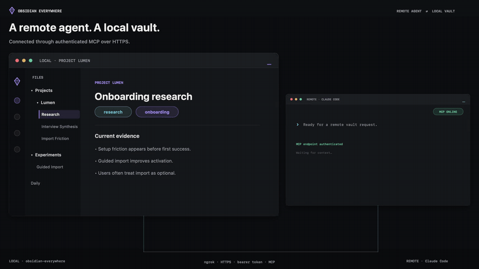
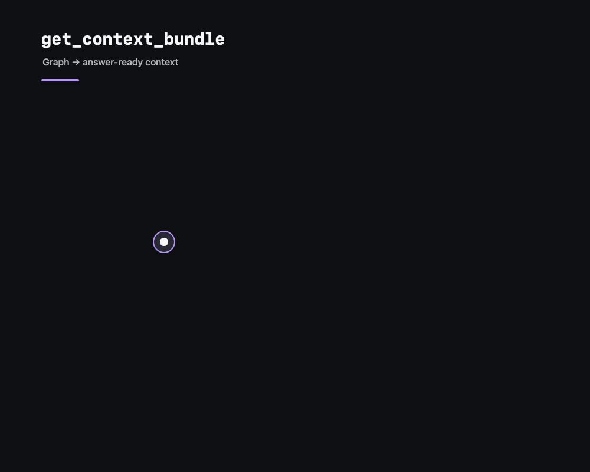

<div align="center">

[English](README.md) | [한국어](README.ko.md)

# 🧠 Obsidian Everywhere

**Turn linked notes into AI context — and securely bridge your local vault to agents running anywhere.**

[](https://github.com/junnnnnw00/obsidian-everywhere/actions/workflows/ci.yml)
[](LICENSE)
[](package.json)
[](tsconfig.json)
[](https://modelcontextprotocol.io)
[](https://www.npmjs.com/package/obsidian-everywhere)
[](https://www.npmjs.com/package/obsidian-everywhere)
[](CONTRIBUTING.md)

*Graph context · local semantic search · safe edits · remote agents over MCP*

[](https://glama.ai/mcp/servers/junnnnnw00/obsidian-everywhere)

</div>

## Watch the Remote Vault Bridge in 44 seconds



[Remote setup guide](docs/ngrok-remote.md)

*Remote request → semantic search → graph context → guarded edit → mount-loss recovery.*

---

Obsidian Everywhere is built around two ideas:

1. **Notes are a graph and a semantic knowledge base, not a folder of text
   files.** Backlinks, n-hop neighborhoods, shortest paths, PageRank, full-text
   search, and local multilingual embeddings turn a topic into focused,
   token-budgeted context.
2. **Your vault should be usable where your agents run.** The Remote Vault
   Bridge exposes that same graph and its guarded write tools over authenticated
   Streamable HTTP. A Claude Code or Codex process on another server can search,
   reason over, append to, and reorganize a vault that remains on your own
   machine.

The local path stays the source of truth. There is no hosted copy, telemetry
service, or mandatory cloud account. Remote access is a transport you operate,
not a vault-sync product.

## Contents

- [Watch the Remote Vault Bridge in 44 seconds](#watch-the-remote-vault-bridge-in-44-seconds)
- [Features](#features)
- [Two core capabilities](#two-core-capabilities)
- [Try it without your vault](#try-it-without-your-vault)
- [Why Obsidian Everywhere?](#why-obsidian-everywhere)
- [Where does this actually run?](#where-does-this-actually-run)
- [Quickstart](#quickstart)
- [Configuration](#configuration)
- [Development](#development)
- [Project status](#project-status)
- [Contributing](#contributing)
- [License](#license)

## Features

```
vault (.md files)
  │  parse · watch
  ▼
SQLite index (FTS5)  ⇄  in-memory graph (graphology)
  │                       n-hop · shortest path · PageRank
  ▼
39 MCP tools
  │
  ▼
local stdio  ·  authenticated remote HTTP  ·  OAuth HTTP
```

- 🧩 **Graph + semantic context engine** — a markdown parser (wikilinks, embeds,
  frontmatter, nested tags, headings, block references), a SQLite index
  with full-text search, and an in-memory [graphology](https://graphology.github.io/)
  layer for n-hop traversal, shortest paths, and PageRank. `get_context_bundle`
  packs a topic and its most useful neighbors into a requested token budget.
- 🌍 **Remote Vault Bridge** — agents on an external server get the same search,
  graph, context, and guarded editing tools over authenticated Streamable HTTP.
  Use a private network or an HTTPS tunnel such as ngrok; the vault itself stays
  on the machine you control.
- 🧠 **Local semantic search** — `semantic_search` and `get_related` with
  `method: "semantic"` run a small multilingual embedding model
  (`multilingual-e5-small`) entirely on your machine — no API key, cloud
  account, or Ollama process to run. Downloads once (~120MB, cached under
  `~/.obsidian-everywhere/`), then works fully offline.
- 🛡️ **Safe writes and resilient mounts** — partial edits, dry-run-first bulk
  operations, rollback snapshots, recoverable deletion, and an opt-in Beta
  mount guard. If a removable drive, NAS share, or container mount disappears,
  the index is preserved, writes are blocked, and a full reconciliation runs
  after it returns.
- 🛠️ **39 graph-native MCP tools** — structured reads, graph navigation,
  semantic retrieval, safe lifecycle operations, persisted Obsidian settings,
  and explicit `vault_status` health reporting.

## Two core capabilities

### 1. Turn a linked vault into focused AI context

Exact search finds the words you wrote. Semantic search finds the idea even
when the wording or language differs. Graph traversal then explains how the
matching notes relate. `get_context_bundle` combines those signals into a
bounded context package instead of dumping an entire vault into the model.

### 2. Use and edit that context from an external server

Run Obsidian Everywhere beside the local vault, expose its HTTP endpoint through
your private network or an HTTPS tunnel, and register the URL in the remote MCP
client. The remote agent can read and search the local vault, then use the same
guarded tools to create, append, move, tag, or clean up notes. The server
reindexes each successful write before returning, so the next remote tool call
sees the change.

For the complete ngrok path, see the
**[Remote Vault Bridge with ngrok tutorial](docs/ngrok-remote.md)**.

<details>
<summary><strong>Full tool list</strong></summary>

**Read**

| Tool | What it does |
|---|---|
| `vault_overview` | Note counts, top tags, PageRank hub notes, recently modified — a starting orientation |
| `vault_status` | Mount availability, index freshness, write availability, and last full reconciliation |
| `search_notes` | Full-text search with tag/folder filters (with a trigram fallback for CJK substring matches unicode61 alone would miss — see DECISIONS.md D9), each result annotated with link counts and tags |
| `semantic_search` | Meaning-based search via local embeddings (`multilingual-e5-small`, no external service) — finds conceptually related notes that don't share the query's exact words |
| `read_note` | Structured content/frontmatter/links/tags plus line pagination; optional heading-scoped read |
| `list_notes` | Explicit folder-aware note listing with pagination; optionally projects named frontmatter fields (e.g. `status`, `project`) per note |
| `list_folder` | Immediate child folders, notes, and attachments |
| `regex_search` | JavaScript-regex search with file, line, and excerpt |
| `get_backlinks` | Every note linking to a given note, with the linking sentence |
| `get_neighborhood` | Explicit n-hop node/edge list around a note (links treated as undirected) |
| `get_context_bundle` | **The killer feature.** Center note + prioritized 1-hop neighbors packed into a token budget |
| `list_tags` | Full nested tag hierarchy with counts |
| `get_notes_by_tag` | Notes carrying a given tag (nested-aware) |
| `find_orphans` | Notes with no incoming or outgoing links |
| `find_unresolved` | Links that don't resolve to any note, grouped by target |
| `find_path` | Shortest connection path between two notes, with a one-line summary per hop |
| `get_related` | Similar notes that *aren't* directly linked yet — Jaccard over shared tags/neighbors by default, or `method: "semantic"` for embedding similarity |
| `get_hotkeys` / `get_obsidian_settings` | Persisted hotkey command IDs, Templates folder, and core-plugin settings |
| `validate_base` | Static YAML/shape validation for `.base` files or fenced Base blocks |

**Write**

| Tool | What it does |
|---|---|
| `create_note` | Create a new note (with frontmatter); reindexed immediately — the next tool call already sees it |
| `apply_template` | Create a note from a template, substituting `{{date}}`/`{{time}}`/`{{title}}` (Obsidian's core Templates variables) |
| `append_to_note` | Append to a note, optionally under a specific heading; fails closed if the heading isn't found |
| `move_note` / `rename_note` / `delete_note` | Lifecycle operations with inbound-link rewriting, backlink guardrails, and recoverable trash |
| `replace_text` / `patch_section` | Guarded exact-text and heading-scoped edits |
| `update_frontmatter` / `remove_frontmatter_field` | Change properties without replacing the note body |
| `bulk_update_frontmatter` / `bulk_remove_frontmatter_field` | Same, across every note in a folder (or the whole vault); dry-run first with rollback |
| `add_tags` / `remove_tags` | Add or remove frontmatter tags on one note |
| `rename_tag` | Rename a tag vault-wide across frontmatter and inline `#tag` text, dry-run first with rollback |
| `bulk_replace` / `rollback_bulk_edit` | Dry-run-first folder/regex replacement with snapshots and rollback |
| `set_hotkey` / `set_templates_folder` | Update persisted Obsidian settings (vault reload may be required) |

Write tools are on by default for stdio and the
bearer-token HTTP transport, and off by default for the public OAuth
connector transport (opt in with `OAUTH_ENABLE_WRITE_TOOLS=true`) — see
[Configuration](#configuration) and DECISIONS.md D15.

</details>

## Try it without your vault

Run the built-in demo first. It creates a temporary sample vault, shows graph
orientation and unresolved-link discovery, previews a safe bulk edit, and then
removes the sample. It never reads or changes your own notes.

```bash
npx -y obsidian-everywhere demo
```



When you are ready to connect a real vault, generate copyable configuration for
Codex, ChatGPT Desktop, Claude Code, and Claude Desktop:

```bash
npx -y obsidian-everywhere init /absolute/path/to/your/vault
npx -y obsidian-everywhere doctor /absolute/path/to/your/vault
```

`init` only prints configuration—it never edits global client settings.
`doctor` checks Node.js, permissions, Obsidian metadata, SQLite, parsing, and the
graph engine without printing note content. Add `--share` to redact the vault
path before pasting diagnostics into an issue.

## Why Obsidian Everywhere?

There are several good Obsidian MCPs. Pick the architecture that matches how
you work rather than assuming one server wins every category.

| | **Obsidian Everywhere** | [obsidian-mcp-server](https://github.com/cyanheads/obsidian-mcp-server) | [Local REST API](https://github.com/coddingtonbear/obsidian-local-rest-api) | [TurboVault](https://github.com/epistates/turbovault) |
|---|---|---|---|---|
| Install | `npx` | `npx` | Obsidian community plugin | `cargo install` / binary |
| Published tools | **39** | 14 | 16 | 74 |
| Obsidian must be open | **No** | Yes | Yes | **No** |
| Best graph capability | PageRank, shortest path, n-hop, unresolved links | Outgoing links in structured reads | Live Obsidian metadata/search | Multi-hop, centrality, clusters, suggestions |
| Safe editing | Partial edits; bulk dry-run, snapshot, rollback | Surgical edits and frontmatter/tag management | Live heading/block/frontmatter patching | Conflict hashes, audit rollback, Git-backed batch |
| Live app commands/current file | Persisted settings only | **Yes** | **Yes** | No |
| Remote transport | stdio, bearer HTTP over private network or HTTPS tunnel, **OAuth 2.1** | stdio, HTTP with JWT/OAuth | HTTP with API key | stdio, HTTP, WebSocket, TCP |
| Best fit | Graph + semantic context from a headless vault, including guarded remote access and edits | Rich app-driven CRUD and Omnisearch | Direct control of a running Obsidian app | Maximum breadth, multi-vault and advanced analysis |

Comparison checked against each project's published documentation on
2026-07-20. A blank or narrower cell means “not documented there,” not that a
project can never support it. If you need active-file state or command-palette
execution, choose a plugin-backed server. If you want a headless, one-command
graph server with token-budgeted context and guarded cleanup, that is the niche
Obsidian Everywhere is designed for.

Everything runs locally by default. There is no account, API key, hosted vault,
or telemetry requirement.

See [`docs/architecture.md`](docs/architecture.md) for how it's built,
[`docs/deploy.md`](docs/deploy.md) for the deployment topology, and
[`docs/ngrok-remote.md`](docs/ngrok-remote.md) for an end-to-end external
server tutorial.

## Where does this actually run?

**The `obsidian-everywhere` process needs direct filesystem access to your
vault's `.md` files** (to parse them, watch for changes, etc.) — so it
must always run on **the machine where your vault physically lives**
("the vault machine": your laptop, most likely). It does not matter which
client machine you're working from — the *server* always runs on the vault
machine; only the *client* connection method changes.

| Where you use the MCP client | What you need |
|---|---|
| The same machine as the vault | **stdio.** Nothing else — Codex, ChatGPT Desktop, Claude Code/Desktop, or another local client spawns the server directly. |
| A different machine you control (a lab/work server, another laptop, an SSH box) | **Bearer-token HTTP** over a private network such as [Tailscale](https://tailscale.com/download), or an HTTPS tunnel such as [ngrok](docs/ngrok-remote.md). |
| claude.ai (web app or mobile app) | **OAuth HTTP** + a public HTTPS URL (via [Cloudflare Tunnel](https://developers.cloudflare.com/cloudflare-one/connections/connect-networks/)). claude.ai runs in Anthropic's cloud, not your network, so it can't reach Tailscale or `localhost` — it needs a real public address. |

You can run more than one of these at once (e.g. stdio on your laptop
*and* bearer-token HTTP for your work server) — they're independent
processes that all index the same vault.

## Quickstart

The fastest install needs no clone or build step. Run this **on the vault
machine** (wherever your `.md` files live):

```bash
npx -y obsidian-everywhere /absolute/path/to/your/vault
```

MCP clients normally launch this command for you using one of the
configurations below.

Not sure whether the path and runtime are ready? Run the privacy-safe diagnostic:

```bash
npx -y obsidian-everywhere doctor /absolute/path/to/your/vault
```

### Option A — Codex CLI and ChatGPT Desktop, same machine as the vault (stdio)

Codex CLI, the Codex IDE extension, and ChatGPT Desktop's Codex experience
share the same MCP configuration ([official MCP documentation](https://learn.chatgpt.com/docs/extend/mcp)).
Add the server once:

```bash
codex mcp add obsidian-everywhere -- npx -y obsidian-everywhere /absolute/path/to/your/vault
codex mcp list
```

Then restart ChatGPT Desktop (or the IDE extension). In ChatGPT Desktop you
can also add it through **Settings → MCP servers → Add server**, choose
**STDIO**, and enter the same command and arguments. Type `/mcp` in Codex to
confirm that the server and its 39 tools are connected.

For a project-scoped configuration instead, add this to a trusted project's
`.codex/config.toml`; use `~/.codex/config.toml` to make it available globally:

```toml
[mcp_servers.obsidian-everywhere]
command = "npx"
args = ["-y", "obsidian-everywhere", "/absolute/path/to/your/vault"]
startup_timeout_sec = 30
```

Use an absolute vault path. GUI apps may not inherit the same `PATH` as your
terminal; if `npx` is not found, replace `command` with the absolute result
of `command -v npx`.

### Option A′ — Claude Code, same machine as the vault (stdio)

Still on the vault machine:

```bash
claude mcp add obsidian-everywhere -- npx -y obsidian-everywhere /path/to/your/vault
```

Or with environment variables instead of a positional arg:

```bash
OBSIDIAN_VAULT_PATH=/path/to/your/vault claude mcp add obsidian-everywhere -- npx -y obsidian-everywhere
```

### Option A″ — Claude Desktop, same machine as the vault

Add to `claude_desktop_config.json` on the vault machine:

```json
{
  "mcpServers": {
    "obsidian-everywhere": {
      "command": "npx",
      "args": ["-y", "obsidian-everywhere", "/absolute/path/to/your/vault"]
    }
  }
}
```

### Option A‴ — Google Antigravity CLI (agy)

Add to your global Antigravity MCP configuration file (`~/.gemini/config/mcp_config.json`):

```json
{
  "mcpServers": {
    "obsidian-everywhere": {
      "command": "npx",
      "args": ["-y", "obsidian-everywhere", "/absolute/path/to/your/vault"]
    }
  }
}
```

### Option B — Codex, ChatGPT Desktop, or Claude on a different machine

Choose one secure route to the vault machine:

- **Private network:** use Tailscale and follow the steps below.
- **Public HTTPS tunnel:** use the read-only-first
  [ngrok Remote Vault Bridge tutorial](docs/ngrok-remote.md). Never expose
  the local plaintext HTTP port directly.

**Step 1 — set up a private network between the two machines**, if you chose
Tailscale:

```bash
# on BOTH the vault machine and the MCP client machine
curl -fsSL https://tailscale.com/install.sh | sh   # or: brew install tailscale (macOS)
tailscale up                                        # opens a browser to log in / join your "tailnet"
tailscale status                                    # confirm both machines can see each other
```

Note the vault machine's Tailscale hostname/IP from `tailscale status`
(something like `my-macbook.tailnet-name.ts.net` or `100.x.y.z`).

**Step 2 — start the server, on the vault machine:**

```bash
OBSIDIAN_VAULT_PATH=/path/to/vault OBSIDIAN_EVERYWHERE_TOKEN=$(openssl rand -hex 32) \
  npx -y --package obsidian-everywhere obsidian-everywhere-http
```

Keep this token — you'll need it in step 3. (To keep this running
persistently instead of in a foreground terminal, see the LaunchAgent
setup in [`docs/deploy.md`](docs/deploy.md#2-remote-clients-over-tailscale-static-bearer-token),
or run it in Docker via `docker-compose.yml` if the vault machine is a server.)

**Step 3 — connect from the *other* machine** (the lab server, etc.), using
the vault machine's Tailscale address from step 1. For Codex (and the shared
ChatGPT Desktop configuration), keep the token in an environment variable:

```bash
export OBSIDIAN_EVERYWHERE_CLIENT_TOKEN="<the token from step 2>"
codex mcp add obsidian-everywhere \
  --url http://<vault-machine-tailscale-name>:3737/mcp \
  --bearer-token-env-var OBSIDIAN_EVERYWHERE_CLIENT_TOKEN
```

Ensure ChatGPT Desktop is launched with that environment variable available,
then restart it. Alternatively, use **Settings → MCP servers** to add the
Streamable HTTP URL and bearer credential if your app version exposes those
fields.

For Claude Code:

```bash
claude mcp add --transport http obsidian-everywhere \
  http://<vault-machine-tailscale-name>:3737/mcp \
  --header "Authorization: Bearer <the token from step 2>"
```

The second machine now has access to the vault indexed on the first. Full
walkthrough (Docker, LaunchAgent):
[`docs/deploy.md`](docs/deploy.md#2-remote-clients-over-tailscale-static-bearer-token).

### Option C — claude.ai web/mobile app (custom connector, OAuth)

This needs a public HTTPS endpoint — claude.ai's servers can't reach your
Tailscale network or `localhost`. See
[`docs/deploy.md`](docs/deploy.md#3-claudeai-webmobile-custom-connector-oauth-21--cloudflare-tunnel)
for the full Cloudflare Tunnel walkthrough (including the no-domain-needed
Quick Tunnel option for testing). Once your server is reachable at
`https://your-domain`:

1. claude.ai → Settings → Connectors → Add custom connector
2. Server URL: `https://your-domain/mcp`
3. claude.ai auto-discovers the OAuth flow and shows this server's sign-in
   page — enter the `OAUTH_LOGIN_SECRET` you configured.

**You only need this if you actually want claude.ai's web/mobile apps to
read your vault.** If you only ever use Claude Code (locally or from
another machine), skip this entirely — Option A/B already fully covers
that with no Cloudflare/OAuth involved.

## Configuration

| Env var | Used by | Meaning |
|---|---|---|
| `OBSIDIAN_VAULT_PATH` | all | Vault path (or pass as a positional CLI arg) |
| `OBSIDIAN_EVERYWHERE_DB` | all | SQLite index path override. Defaults are transport-specific: `index-stdio.db`, `index-http.db`, or `index-oauth.db` under `<vault>/.obsidian-everywhere/`. |
| `OBSIDIAN_EVERYWHERE_TOKEN` | `http-cli.js` | Static bearer token |
| `PORT` | `http-cli.js`, `oauth-http-cli.js` | HTTP port (defaults 3737 / 3738) |
| `OAUTH_ISSUER_URL` | `oauth-http-cli.js` | Public HTTPS origin (e.g. your Cloudflare Tunnel hostname) |
| `OAUTH_LOGIN_SECRET` | `oauth-http-cli.js` | Single-user login secret |
| `OBSIDIAN_EVERYWHERE_READONLY` | `cli.js`, `http-cli.js` | Set to `true` to disable all write tools (default: write tools on) |
| `OBSIDIAN_EVERYWHERE_MOUNT_GUARD` | all entrypoints | Opt-in Beta mount-loss protection and automatic reconciliation |
| `OBSIDIAN_EVERYWHERE_MOUNT_SENTINEL` | all entrypoints | Optional vault-relative identity path, e.g. `.obsidian/app.json` |
| `OBSIDIAN_EVERYWHERE_MOUNT_RECHECK_MS` | all entrypoints | Runtime mount probe interval (default `5000`) |
| `OAUTH_ENABLE_WRITE_TOOLS` | `oauth-http-cli.js` | Set to `true` to enable all write tools on the public connector (default: off) |

## Development

```bash
npm run dev:stdio          # tsx, no build step
npm run dev:http
npm run dev:oauth-http
npm test                   # vitest, runs against fixtures/test-vault
npm run typecheck
npm run lint
npm run format:check
```

`fixtures/test-vault/` is a 30+ note fixture vault exercising every link
and parsing edge case the parser needs to handle (piped aliases, heading
and block links, embeds, frontmatter-embedded wikilinks, nested tags,
duplicate filenames across folders, unresolved links, code-block
exclusion, and Korean filenames/tags/wikilinks). It's what every test in
`src/**/*.test.ts` runs against.

## Project status

Current v0.7.0 includes the graph and local semantic context engine, all three
transports (stdio, bearer HTTP, OAuth HTTP), 39 MCP tools, guarded partial and
bulk writes, and client setup for Codex, ChatGPT Desktop, and Claude. Remote
Vault Bridge is a first-class deployment path. Its opt-in mount guard remains
**Beta** while it receives cross-platform feedback for removable drives, NAS
shares, and container mounts.

## Contributing

Bug reports, feature requests, and PRs are welcome — see
[`CONTRIBUTING.md`](CONTRIBUTING.md) for dev setup, testing conventions,
and how the fixture vault relates to the test suite. Security issues:
please see [`SECURITY.md`](SECURITY.md) rather than opening a public issue.

## License

MIT — see [`LICENSE`](LICENSE).
